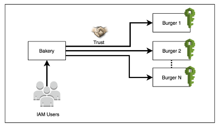
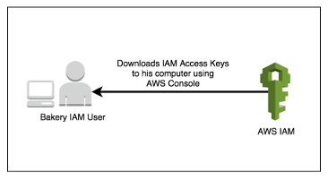
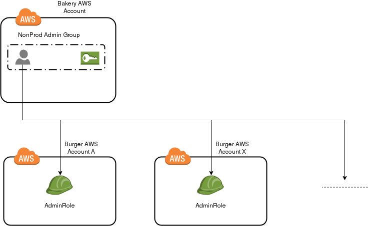

# Bakery and Burgers

Bakery is a centralised AWS identity and access management solution to avoid the duplication of user accounts/policies across multiple AWS accounts. In a nutshell, you just use one AWS account (called Bakery) for managing IAM users and assign right policies to gain access to other AWS account(s) which we call Burgers.

#### Terminologies

- Bakery: An AWS Account to manage IAM Users and Groups.
- Burger: An AWS Account where Bakery Users federate into.
- AccessType: Level of access, like 'Admin', 'PowerUser', 'ReadOnly'
- Environment: Type of AWS environment, like 'Prod', 'PreProd', 'Mgmt' (aka Management)

### Key Concepts

- IAM Users and IAM Groups are created ONLY in Bakery Account
- IAM Users are members of IAM Groups created in same Bakery Account
- Bakery Account manages various privileged access to Burger Accounts
- IAM policies assigned to IAM Group grants AssumeRole access to associated Burger Role

## How it works

Bakery and Burger implementation is nothing but a process of delegating right level of access across multiple AWS accounts as mentioned in this [AWS documentation](https://docs.aws.amazon.com/IAM/latest/UserGuide/tutorial_cross-account-with-roles.html).

Below are few key steps which explains the workflow of Bakery

1. Firstly, a trust between two AWS accounts i.e. Bakery & Burgers is created. This process involves creation of IAM access policies & IAM roles.



2. IAM users get created in Bakery account with right level of access. The users can then download AWS access keys from Bakery account.



3. Using downloaded AWS credentials, IAM users can assume relevant role in Burger account.


## Architectural overview



As per mentioned in the diagram above
- The `NonProd Admin Group` is a [Bakery Environment Group](#bakery-environment-groups), a Bakery Environment Group is composed of an IAM Group 
and a STS Policy that is assigned to the group. The STS Policy gives privilege to assume AdminRole.
- In this example any member in ```NonProd Admin Group``` can assume AdminRole in any Burger Account that belongs to NonProd Environment Group.
- [We can customize and scale accordingly](#customizability-and-scalability)

# Quickstart

1. Manually [deploy cloudformation template](https://docs.aws.amazon.com/AWSCloudFormation/latest/UserGuide/cfn-using-console.html)
[burger_account.yml](https://github.com/AutomationKitchen/bakery_stack/blob/master/deploy_cloudformation/burger/burger_account.yml) 
to your burger accounts. This cloudformation template creates three IAM Roles with different privileges. Please note down the ARNs as they will be needed in next step.
2. Modify 
[Mappings](#mapping) section in 
[bakery_env.yml](https://github.com/AutomationKitchen/bakery_stack/blob/master/deploy_cloudformation/bakery/bakery_env.yml) 
with the IAM Role ARN created in step 1.
3. Run ```make deploy-bakery-cf-in-docker``` against your Bakery Account
4. Add IAM Users to [Bakery Environment Groups](#bakery-environment-groups) for them to get assume role access to Burger Accounts

#### Mappings

Senario: 
- Aws Accounts 111111111111 and 222222222222 are for nonprod usage.
- Aws Accounts 333333333333, 444444444444 and 555555555555 are for production usage.
- Aws Account 666666666666 is for management usage.

The following 
[mapping](https://github.com/AutomationKitchen/bakery_stack/blob/7b9454d2b9c0de43e627733cd3d7ed83894db820/deploy_cloudformation/bakery/bakery_env.yml#L28) 
is grouping aws accounts 

- 111111111111 and 222222222222 as NonProd accounts ([Bakery Environment Group](#bakery-environment-groups)).
- 333333333333, 444444444444 and 555555555555 as Prod accounts ([Bakery Environment Group](#bakery-environment-groups)).
- 666666666666 as Mgmt accounts ([Bakery Environment Group](#bakery-environment-groups)).

**Replace IAM Role ARNs with your real Burger IAM Role ARN**

```
Mappings:
  NonProd:
    Admin:
      roles: >-
        arn:aws:iam::111111111111:role/BurgerTeamNameNonProdAdmins,
        arn:aws:iam::222222222222:role/BurgerTeamNameNonProdAdmins
    PowerUser:
      roles: >-
        arn:aws:iam::111111111111:role/BurgerTeamNameNonProdPowerUser,
        arn:aws:iam::222222222222:role/BurgerTeamNameNonProdPowerUser
    ReadOnly:
      roles: >-
        arn:aws:iam::111111111111:role/BurgerTeamNameNonProdReadOnly,
        arn:aws:iam::222222222222:role/BurgerTeamNameNonProdReadOnly
  Prod:
    Admin:
      roles: >-
        arn:aws:iam::333333333333:role/BurgerTeamNameProdAdmins,
        arn:aws:iam::444444444444:role/BurgerTeamNameProdAdmins,
        arn:aws:iam::555555555555:role/BurgerTeamNameProdAdmins
    PowerUser:
      roles: >-
        arn:aws:iam::333333333333:role/BurgerTeamNameProdPowerUser,
        arn:aws:iam::444444444444:role/BurgerTeamNameProdPowerUser,
        arn:aws:iam::555555555555:role/BurgerTeamNameProdPowerUser
    ReadOnly:
      roles: >-
        arn:aws:iam::333333333333:role/BurgerTeamNameProdReadOnly,
        arn:aws:iam::444444444444:role/BurgerTeamNameProdReadOnly,
        arn:aws:iam::555555555555:role/BurgerTeamNameProdReadOnly
  Mgmt:
    Admin:
      roles: arn:aws:iam::666666666666:role/BurgerTeamNameMgmtAdmins
    PowerUser:
      roles: arn:aws:iam::666666666666:role/BurgerTeamNameMgmtPowerUser
    ReadOnly:
      roles: arn:aws:iam::666666666666:role/BurgerTeamNameMgmtReadOnly
```

Each account has three [Access Type](#access-types) (Admin, Prod, ReadOnly) of IAM roles with different privileges.  
[We can customize and scale accordingly](#customizability-and-scalability)

### Bakery Environment Groups

Bakery Environment Groups (or Environments) are aws account groupings. We group accounts depending on workloads, security requirements or account classification. 
Each group will have AssumeRole access to ```Access Type``` Roles in Burger Accounts.

Default Bakery Environment Groups:
- NonProd
- Prod
- Mgmt

### Access Types

Access Types are types of access that a user can assume.

Default Access Types:
- Admin
- PowerUser
- ReadOnly

## Cloudformation Templates

### Bakery

- [bakery_stack](https://github.com/AutomationKitchen/bakery_stack/blob/master/deploy_cloudformation/bakery/bakery_stack.yml): 
The main stack that calls bakery_account and multiple barkery_env nested stacks.
- [bakery_account](https://github.com/AutomationKitchen/bakery_stack/blob/master/deploy_cloudformation/bakery/bakery_account.yml): 
Creates AdminGroup and UserGroup for managing Bakery Account.
- [bakery_env](https://github.com/AutomationKitchen/bakery_stack/blob/master/deploy_cloudformation/bakery/bakery_env.yml): 
This template creates a IAM Group and IAM Policy according to Bakery Environment Groups and Access Type. 
IAM User that belongs to the IAM Group will have Access Type priviliages to Burger Accounts in the Bakery Environment Groups, 
By default we create a stack per 
Environment/Access Type combination 9 stacks in total. (NonProd, Prod, Mgmt) X (Admin, PowerUser, ReadOnly)

### Burger

- [burger_account](https://github.com/AutomationKitchen/bakery_stack/blob/master/deploy_cloudformation/burger/burger_account.yml): 
Deploy this template in your Burger account. By default it creates a AdminRole, PowerUserRole and ReadOnlyRole.

## Customizability and Scalability

We can scal the solution in three directions
- [Adding Burger Accounts](#adding-burger-accounts)
- [Adding Bakery Environment Groups](#adding-bakery-environment-groups)
- [Adding Access Types](#adding-access-types)

### Adding Burger Accounts

To add a new Burger Account to be managed by Bakery just follow the [Quickstart](#quickstart) steps

### Adding Bakery Environment Groups

Senario: I would like to add a new Bakery Environment Group called ```Test``` that groups testing aws accounts together.
Steps:
1. Add ```Test``` key value to Mapping(#mapping)

```
  Test:
    Admin:
      roles: >-
        arn:aws:iam::777777777777:role/BurgerTeamNameTestAdmins
    PowerUser:
      roles: >-
        arn:aws:iam::777777777777:role/BurgerTeamNameTestPowerUser
    ReadOnly:
      roles: >-
        arn:aws:iam::777777777777:role/BurgerTeamNameTestReadOnly
```
2. Add extra 
[bakery_env.yml](https://github.com/AutomationKitchen/bakery_stack/blob/master/deploy_cloudformation/bakery/bakery_env.yml) 
nested stacks in [bakery_stack.yml](https://github.com/AutomationKitchen/bakery_stack/blob/master/deploy_cloudformation/bakery/bakery_stack.yml)

```
...


  TestAdmin:
    Type: "AWS::CloudFormation::Stack"
    Properties:
      TemplateURL: !Sub "https://s3.amazonaws.com/${CloudFormationS3Bucket}/bakery_env.yml"
      Parameters:
        Environment: Test
        AccessType: Admin

  TestPowerUser:
    Type: "AWS::CloudFormation::Stack"
    Properties:
      TemplateURL: !Sub "https://s3.amazonaws.com/${CloudFormationS3Bucket}/bakery_env.yml"
      Parameters:
        Environment: Test
        AccessType: PowerUser

  TestReadOnly:
    Type: "AWS::CloudFormation::Stack"
    Properties:
      TemplateURL: !Sub "https://s3.amazonaws.com/${CloudFormationS3Bucket}/bakery_env.yml"
      Parameters:
        Environment: Test
        AccessType: ReadOnly

...
```

### Adding Access Types

Senario: I would like to add a new Access Type called ```EC2FullAccess``` that only have privileges to access ec2s.

1. Add IAM Role in 
[burger_account.yml](https://github.com/AutomationKitchen/bakery_stack/blob/master/deploy_cloudformation/burger/burger_account.yml)

```
...

  EC2FullAccessRole:
    Type: "AWS::IAM::Role"
    Properties:
      AssumeRolePolicyDocument:
        Statement:
        - Effect: Allow
          Principal:
            AWS: !Sub "arn:aws:iam::${BakeryAccount}:root"
          Action: sts:AssumeRole
      RoleName: !Sub Burger${TeamName}${Environment}EC2FullAccess
      ManagedPolicyArns:
      - arn:aws:iam::aws:policy/AmazonECS_FullAccess
...
```

2. Add extra key value pair in [bakery_env.yml](https://github.com/AutomationKitchen/bakery_stack/blob/master/deploy_cloudformation/bakery/bakery_env.yml) 
[Mapping](#mappings) **per Bakery Environment Group**
```
...

  NonProd:
    Admin:
      roles: >-
        arn:aws:iam::111111111111:role/BurgerTeamNameNonProdAdmins
    PowerUser:
      roles: >-
        arn:aws:iam::111111111111:role/BurgerTeamNameNonProdPowerUser
    ReadOnly:
      roles: >-
        arn:aws:iam::111111111111:role/BurgerTeamNameNonProdReadOnly
    EC2FullAccess:
      roles: >-
        arn:aws:iam::111111111111:role/BurgerTeamNameNonProdEC2FullAccess

...
```

3. Add extra 
[bakery_env.yml](https://github.com/AutomationKitchen/bakery_stack/blob/master/deploy_cloudformation/bakery/bakery_env.yml) 
nested stacks in [bakery_stack.yml](https://github.com/AutomationKitchen/bakery_stack/blob/master/deploy_cloudformation/bakery/bakery_stack.yml) 
**per Bakery Environment Group**
```
...


  NonProdEC2FullAccess:
    Type: "AWS::CloudFormation::Stack"
    Properties:
      TemplateURL: !Sub "https://s3.amazonaws.com/${CloudFormationS3Bucket}/bakery_env.yml"
      Parameters:
        Environment: NonProd
        AccessType: EC2FullAccess

  ProdEC2FullAccess:
    Type: "AWS::CloudFormation::Stack"
    Properties:
      TemplateURL: !Sub "https://s3.amazonaws.com/${CloudFormationS3Bucket}/bakery_env.yml"
      Parameters:
        Environment: Prod
        AccessType: EC2FullAccess

  MgmtEC2FullAccess:
    Type: "AWS::CloudFormation::Stack"
    Properties:
      TemplateURL: !Sub "https://s3.amazonaws.com/${CloudFormationS3Bucket}/bakery_env.yml"
      Parameters:
        Environment: Mgmt
        AccessType: EC2FullAccess

...
```

## Utils
Please view [README](https://github.com/AutomationKitchen/bakery_stack/blob/master/utils/README.md) for command line helper tool to assume roles in burger accounts
